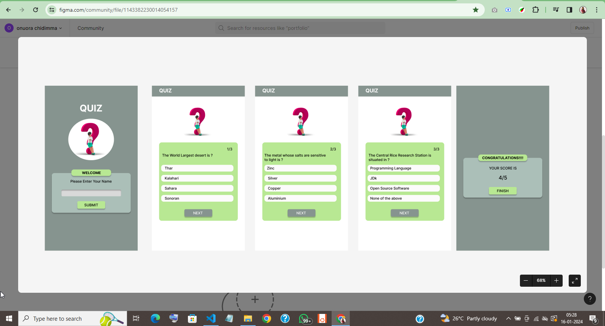

# Quiz Application Documentation

## Features:

### Quiz Questions Array:

The quiz questions are stored in an array named `quizArray`. Each question object includes the question statement, multiple-choice options, and the correct answer.

### Introduction and Start Button:

- The introduction container (`introContainer`) and the start button (`startButton`) are selected from the DOM.
- An event listener is added to the start button, triggering the start of the quiz by hiding the introduction and initiating the timer.

### Dynamic Quiz Card Creation:

- The `addQuizCard` function dynamically creates and displays quiz cards with questions and multiple-choice options.
- Each card includes an index indicator, the question, radio buttons for options, and a "Next" button.

### Scoring Mechanism:

- The `calculateScore` function determines if the selected answer is correct, updating the score accordingly.

### Countdown Timer:

- The `startTimer` function initiates a countdown timer with a specified time limit (5 minutes in this case).
- The timer is updated every second using the `setInterval` method, and the `updateTimer` function displays the remaining time.

### Next Button and Navigation:

- The "Next" button triggers the `showNextQuestion` function, which calculates the score, increments the question index, and updates the quiz card.
- An alert is shown if no option is selected before clicking "Next."

### Score Page:

- The `showScorePage` function displays the final score, time remaining, and a "Back to Quiz" button.
- The "Back to Quiz" button resets the quiz, bringing the user back to the start page.

## Instructions for Running the Application:

## Design and Functionality Insights:

### Dynamic Card Creation:

The decision to dynamically create quiz cards allows for a clean and organized presentation of questions and options.

### Scoring Mechanism:

The scoring mechanism ensures accurate tracking of the user's performance throughout the quiz.

### Countdown Timer:

A countdown timer adds a sense of urgency and enhances the quiz experience. It also prevents users from taking an unlimited amount of time.

### User Interaction:

The use of alerts for unselected options and the "Next" button provides clear feedback to users, guiding them through the quiz.

### Reset and Navigation:

The "Back to Quiz" button on the score page allows users to reset the quiz and start again, providing a seamless navigation experience.

### CSS Styling:

Simple and clean styling enhances readability and ensures a pleasant visual experience for users.

---

*Note: The quiz app design was obtained from Figma community, designed by Mahmood Khan.*
[Design Link](https://www.figma.com/community/file/1143382230014054157)

This quiz application aims to provide an engaging and user-friendly experience, with a focus on clarity in design and functionality.
